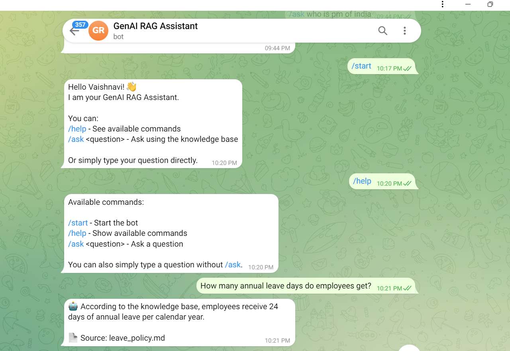
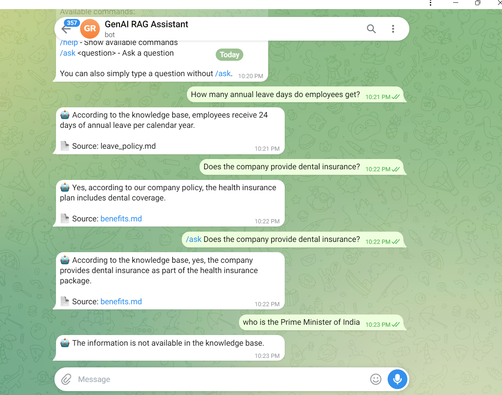

# GenAI Mini-RAG Telegram Bot

A lightweight Retrieval-Augmented Generation (RAG) Telegram chatbot built with Python.

This project answers employee-policy questions using a local knowledge base, semantic retrieval, SQLite storage, and a local Llama 3.2 model through Ollama.

## Project Overview

This project demonstrates an end-to-end Mini-RAG pipeline:

```text
User Question
     ↓
Telegram Bot
     ↓
Query Embedding
     ↓
SQLite Knowledge Base
     ↓
Semantic Similarity Retrieval
     ↓
Relevant Context
     ↓
Llama 3.2 via Ollama
     ↓
Grounded Answer
     ↓
Telegram
```

The system retrieves relevant information from the knowledge base before generating an answer.

For questions outside the available knowledge base, the system returns:

> The information is not available in the knowledge base.

## Features

- Telegram chatbot interface
- `/start` command
- `/help` command
- `/ask <question>` command
- Direct natural-language questions without `/ask`
- 4 Markdown knowledge documents
- Section-based document chunking
- 18 searchable knowledge chunks
- Local embeddings using `all-MiniLM-L6-v2`
- 384-dimensional sentence embeddings
- SQLite-based local storage
- Semantic similarity retrieval
- Top-k retrieval
- Relevance threshold for unsupported questions
- Llama 3.2 3B running locally through Ollama
- Source document displayed with answers
- CLI demo for testing the RAG engine without Telegram

## Tech Stack

| Component | Technology |
|---|---|
| Programming Language | Python 3.11 |
| Telegram Framework | python-telegram-bot 22.8 |
| Embedding Framework | Sentence Transformers |
| Embedding Model | all-MiniLM-L6-v2 |
| Embedding Size | 384 dimensions |
| Database | SQLite |
| LLM Runtime | Ollama |
| LLM | Llama 3.2 3B |
| Configuration | python-dotenv |

## Knowledge Base

The bot uses four sample company-policy documents:

- `leave_policy.md`
- `benefits.md`
- `work_from_home.md`
- `faq.md`

The four documents are divided into **18 searchable chunks**.

### Example knowledge covered

**Leave Policy**
- Annual leave
- Sick leave
- Public holidays
- Leave approval

**Employee Benefits**
- Health insurance
- Dental coverage
- Vision coverage
- Retirement plan
- Learning and development
- Wellness program

**Work From Home**
- Eligibility
- Weekly work-from-home allowance
- Temporary remote work
- Office attendance
- Equipment

**FAQ**
- Password reset
- IT support
- Employee onboarding
- Training
- Expense reimbursement

## Project Structure

```text
genai-rag-telegram-bot/
│
├── app.py
├── rag.py
├── retrieval.py
├── database.py
├── ingest.py
├── embeddings.py
├── llm.py
├── demo.py
├── requirements.txt
├── README.md
├── .gitignore
│
├── data/
│   ├── leave_policy.md
│   ├── benefits.md
│   ├── work_from_home.md
│   └── faq.md
│
└── screenshots/
    ├── 01-start.png
    ├── 02-help.png
    ├── 03-annual-leave.png
    ├── 04-dental-insurance.png
    └── 05-out-of-scope.png
```

`rag.db` is generated locally by `database.py` and is intentionally excluded from Git.

## Demo

### 1. Telegram Start



### 2. Telegram Help


### 3. Annual Leave Question


### 4. Dental Insurance Question



### 5. Out-of-Knowledge Question


## RAG Pipeline

### 1. Document Ingestion

Markdown documents are read from the `data/` directory.

### 2. Chunking

Each document is split into smaller sections using Markdown headings.

The current knowledge base produces 18 chunks.

### 3. Embedding Generation

Each chunk is converted into a 384-dimensional embedding using:

`all-MiniLM-L6-v2`

### 4. Local Storage

Chunks and their embeddings are stored in a local SQLite database.

### 5. Retrieval

When a user asks a question:

1. The question is converted into an embedding.
2. The query embedding is compared with stored chunk embeddings.
3. Relevant chunks are ranked by semantic similarity.
4. The best matching chunk is selected.

### 6. Relevance Filtering

The current similarity threshold is:

`0.30`

Questions below this threshold are treated as outside the knowledge base.

### 7. Generation

The retrieved knowledge-base context is passed to Llama 3.2 3B running locally through Ollama.

The prompt instructs the model to answer using only the retrieved knowledge-base context.

## Installation

### Prerequisites

Install:

- Python 3.11+
- Git
- Ollama
- Telegram

### Clone the Repository

```bash
git clone https://github.com/vaish161193/genai-rag-telegram-bot.git
cd genai-rag-telegram-bot
```

### Create Virtual Environment

```cmd
python -m venv .venv
```

Activate it:

```cmd
.venv\Scripts\activate
```

### Install Dependencies

```cmd
pip install -r requirements.txt
```

## Ollama Setup

Install Ollama and download the required model:

```cmd
ollama pull llama3.2:3b
```

Verify:

```cmd
ollama list
```

The model should appear as:

```text
llama3.2:3b
```

## Telegram Bot Setup

Create a Telegram bot using `@BotFather`.

Create a `.env` file in the project root:

```text
TELEGRAM_BOT_TOKEN=YOUR_TELEGRAM_BOT_TOKEN
```

Do not commit `.env` to GitHub.

The evaluator should create their own Telegram bot token.

## Build the Local Knowledge Database

Run:

```cmd
python database.py
```

Expected output:

```text
Creating embeddings...
Inserted 18 chunks with embeddings.
```

This creates the local `rag.db` file.

## Run the Telegram Bot

Activate the virtual environment:

```cmd
.venv\Scripts\activate
```

Start the bot:

```cmd
python app.py
```

Expected output:

```text
Loading embedding model...
Loading knowledge base...
Loaded 18 chunks.
Bot is running...
```

Keep the terminal running while using the Telegram bot.

## Telegram Usage

### Start

```text
/start
```

### Help

```text
/help
```

### Ask Using `/ask`

```text
/ask How many annual leave days do employees get?
```

### Direct Question

You can also simply type:

```text
How many annual leave days do employees get?
```

## Example Questions

### Annual Leave

**Question**

```text
How many annual leave days do employees get?
```

**Expected answer**

```text
Employees receive 24 days of annual leave per calendar year.
```

**Source**

```text
leave_policy.md
```

### Work From Home

**Question**

```text
Can an employee work from home 2 days a week?
```

**Expected answer**

```text
Yes, eligible employees can work from home up to 2 days per week.
```

**Source**

```text
work_from_home.md
```

### Dental Coverage

**Question**

```text
Does the company provide dental insurance?
```

**Expected answer**

```text
The company's health plan includes dental coverage.
```

**Source**

```text
benefits.md
```

### Out-of-Knowledge Question

**Question**

```text
Who is the Prime Minister of India?
```

**Expected behavior**

```text
The information is not available in the knowledge base.
```

## CLI Demo

The core RAG pipeline can also be tested without Telegram.

Run:

```cmd
python demo.py
```

Example:

```text
Question: Does the company provide dental insurance?

Answer:
Yes, the company's full-time employees receive health insurance coverage that includes dental coverage.

Source: benefits.md
```

Type:

```text
exit
```

to stop the CLI demo.

## Security

The following files are intentionally excluded from Git:

```text
.env
.venv/
*.db
__pycache__/
```

The Telegram bot token must never be committed to the repository.

## Limitations

This is a lightweight Mini-RAG implementation intended for demonstration and assessment.

- SQLite is used for local persistence.
- Embeddings are stored locally.
- Ollama runs locally.
- The knowledge base contains sample company-policy documents.
- The similarity threshold is tuned for this small knowledge base.
- The Telegram bot is not deployed as a public production service.
- A live Telegram interaction requires the local bot process to be running.

## Future Improvements

Possible extensions include:

- Conversation history
- Response caching
- `/summarize`
- Improved chunking strategies
- `sqlite-vec` or another vector database
- Streaming LLM responses
- Web deployment
- Authentication and access control

## Author

Vaishnavi Muralidharan

## Repository

https://github.com/vaish161193/genai-rag-telegram-bot
